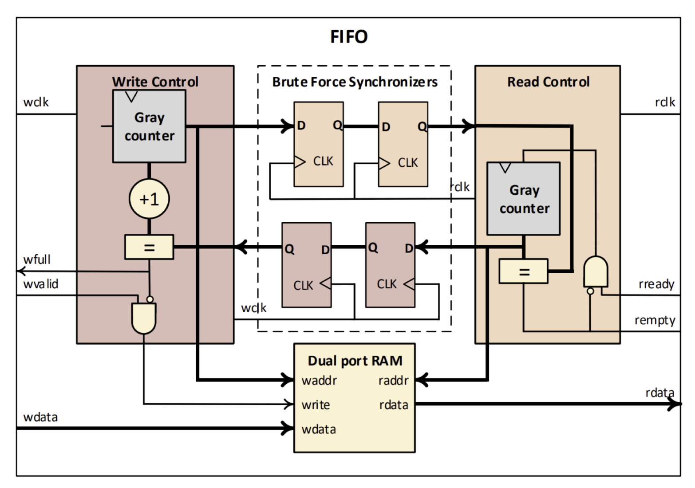

# 비동기 FIFO (Asynchronous FIFO) Verilog 구현

## 1. 프로젝트 개요

본 프로젝트는 Verilog HDL을 사용하여 구현한 비동기 FIFO(Asynchronous FIFO)입니다.

이 코드는 경희대학교 SoC 설계(EE470) 강의자료 내용을 기반으로 한 Verilog 실습의 솔루션입니다.

설계의 핵심 목표는 **서로 다른 클럭 도메인(Write: `CLK_W`, Read: `CLK_R`) 간에 데이터를 안전하게 전송**하는 것입니다.

## 2. 핵심 문제: Metastability

서로 다른 클럭을 사용하는 시스템(Asynchronous)이 직접 통신하면, 수신 측 플립플롭(Flip-Flop)에서 **Setup/Hold Time 위반(Violation)이 발생**할 수 있습니다.

이로 인해 플립플롭의 출력이 0도 1도 아닌 불안정한 상태(Metastable State)에 잠시 머무르게 되며, 이 상태가 언제 안정화될지 예측할 수 없습니다. 이 현상을 **Metastability (준안정성)** 라고 합니다.

## 3. 해결 방안 및 아키텍처

이 문제를 해결하기 위해 강의 자료에서 제시하는 아키텍처를 충실히 따랐습니다.



### 3.1. 2-FF Synchronizer (2-FlipFlop 동기화기)

Metastability가 발생하더라도, 한 클럭 주기(`Tc`) 안에 안정적인 상태로 회복(Resolve)할 시간을 벌어주기 위해 **2개의 플립플롭을 직렬로 연결한 동기화기**를 사용합니다.

강의 자료에서는 이를 "Brute Force Synchronizers"라고도 부릅니다. `full`과 `empty` 신호를 판단하기 위해 상대방의 포인터 값을 이 동기화기를 통해 안전하게 가져옵니다.

### 3.2. Gray Code Pointer (그레이 코드 포인터)

FIFO의 `full`/`empty`를 판단하려면 주소 포인터(Write Pointer, Read Pointer)를 동기화해야 합니다.

하지만 일반적인 2진수(Binary) 포인터는 0111 -> 1000처럼 **여러 비트가 동시에 변경**될 수 있습니다. 만약 이 포인터를 2-FF 동기화기로 넘길 때, 각 비트가 서로 다른 시점에 동기화되면 (예: 0111 -> 0000) 완전히 잘못된 값을 수신하게 됩니다.

이 문제를 해결하기 위해 **Gray Code**를 사용합니다. Gray 코드는 값이 1 증가할 때 **항상 1개의 비트만 변경**되는 특징을 가집니다.

따라서 동기화 과정에서 약간의 지연이 발생하더라도, 수신 측은 '이전 값' 또는 '다음 값' 둘 중 하나의 유효한 값을 받게 되어 시스템이 안정적으로 동작합니다. 본 코드는 `gray_value = (counter>>1)^counter;` 공식을 사용하여 Gray 코드를 올바르게 구현했습니다.

## 4. 설계 분석 및 주요 고려사항

### 4.1. ⚠️ Non-Power-of-2 `DEPTH` 문제

현재 구현된 포인터 래핑(wrapping) 로직(`wptr == DEPTH - 1`)은 **`DEPTH`가 2의 거듭제곱(Power of 2)이 아닐 경우** 오작동을 일으킵니다.

* **증상:** `DEPTH`가 7, 10 등 2의 거듭제곱이 아닐 때, FIFO 용량이 `DEPTH - 1`로 줄어드는 버그가 발생합니다. (예: `DEPTH=7`일 때 6개만 저장하고 `full`이 됨)
* **원인:** `full` 신호는 `wptr_gray_next`와 `rptr_gray_final`을 비교합니다. `DEPTH-1`에서 `0`으로 래핑되는 `wptr_next`의 Gray 값은 `0`이 됩니다. 이는 `rptr_gray_final`이 `0`인 초기 상태(Empty)와 동일하게 인식되어 `full`로 잘못 판단됩니다.
* **해결책:** 이 문제를 근본적으로 해결하려면 포인터의 비트 폭을 `PADDR+1`로 1비트 늘려 MSB를 래핑 감지에 사용하는 표준적인 방법으로 수정해야 합니다.

### 4.2. FWFT (First-Word Fall-Through) 지원 여부

본래의 아키텍처와 초기 코드는 **Non-FWFT** 방식입니다. 즉, `read_en` 신호가 인가된 *다음* 클럭 사이클에 `dout`으로 데이터가 출력됩니다.

* **근거:** 이 방식은 강의 자료의 동기식 FIFO 타이밍 다이어그램과 일치합니다. 해당 다이어그램에서도 `OUTPUT DATA`(D1)는 `READ ENABLE`이 `High`가 된 이후에 출력됩니다.
* **FWFT로 수정:** 만약 `empty`가 `false`가 되는 즉시 `read_en` 없이도 첫 번째 데이터가 `dout`에 나타나는 **FWFT** 방식이 필요하다면, `CLK_R` 도메인의 `rdata` 로직을 다음과 같이 수정해야 합니다.

**Non-FWFT (현재 코드):**
```verilog
always @(posedge CLK_R or negedge rstn) begin
    if (!rstn) begin
        rdata <= 0;
    end else if (read_valid) begin // read_en이 활성화 되어야만 갱신
        rdata <= ram[rptr];
    end 
end
```

**FWFT (수정 코드):**
```verilog
always @(posedge CLK_R or negedge rstn) begin
    if (!rstn) begin
        rdata <= 0;
    // 1. Pop (read_en=1): 다음 데이터를 미리 로드
    end else if (read_valid) begin
        rdata <= ram[rptr_next];
    // 2. Fall-Through/Hold (read_en=0, !empty): 현재 데이터 출력/유지
    end else if (!empty_flag) begin
        rdata <= ram[rptr];
    end 
end
```

## 5. 모듈 포트 및 파라미터

### 파라미터

| 파라미터 | 설명 | 기본값 |
| :--- | :--- | :--- |
| `DEPTH` | FIFO의 깊이 (저장 가능한 데이터 개수) | 8 |
| `WIDTH` | 데이터의 비트 너비 | 16 |
| `PADDR` | 주소 비트 너비 (`$clog2(DEPTH)`) | 3 |

### 포트

| 포트 | 입/출력 | 설명 | 관련 클럭 |
| :--- | :--- | :--- | :--- |
| `CLK_W` | Input | 쓰기 클럭 | - |
| `CLK_R` | Input | 읽기 클럭 | - |
| `rstn` | Input | 비동기 리셋 (Active Low) | - |
| `write_en` | Input | 쓰기 요청 | `CLK_W` |
| `din` | Input [`WIDTH-1`:0] | 쓰기 데이터 | `CLK_W` |
| `full` | Output | FIFO Full 플래그 | `CLK_W` |
| `read_en` | Input | 읽기 요청 | `CLK_R` |
| `dout` | Output [`WIDTH-1`:0] | 읽기 데이터 | `CLK_R` |
| `empty` | Output | FIFO Empty 플래그 | `CLK_R` |

---
---

# Asynchronous FIFO Verilog Implementation

## 1. Project Overview

This project is an Asynchronous FIFO (First-In, First-Out) buffer implemented in Verilog HDL.

This code serves as a solution to the Verilog Exercise presented in the "6. Interface I" lecture for the System-on-Chip (SoC) Design course (EE470) at Kyung Hee University.

The primary objective of this design is to **safely transfer data between two different clock domains** (Write: `CLK_W`, Read: `CLK_R`).

## 2. The Core Problem: Metastability

When asynchronous systems communicate directly, a **Setup/Hold Time Violation** can occur at the receiving flip-flop.

This can cause the flip-flop's output to enter an unstable state (Metastable State)—neither 0 nor 1—for an unbounded amount of time. This phenomenon is known as **Metastability**.

## 3. Solution and Architecture

To resolve this, the implementation faithfully follows the "Overall Architecture" presented in the lecture material.


### 3.1. 2-FF Synchronizer (2-FlipFlop Synchronizer)

To ensure a signal resolves to a stable state even if metastability occurs, a **synchronizer consisting of two serial flip-flops** is used. This provides a full clock period (`Tc`) for the first flip-flop's output to stabilize before being sampled by the second.

The lecture material also refers to this as a "Brute Force Synchronizer". The pointers from the opposing domain are passed through this synchronizer to safely determine the `full` and `empty` conditions.

### 3.2. Gray Code Pointers

To determine the `full`/`empty` status, the address pointers (Write Pointer, Read Pointer) must be synchronized.

A standard binary pointer, however, can have **multiple bits change simultaneously** (e.g., 0111 -> 1000). If this multi-bit value is passed through a 2-FF synchronizer, different bits could be captured at different times, resulting in a completely invalid value (e.g., 0111 -> 0000).

To solve this, **Gray Code** is used. A Gray-coded counter ensures that **only one bit ever changes** per increment.

Therefore, even if there is a delay during synchronization, the receiving side will only see either the "previous value" or the "next value," both of which are valid states, ensuring robust operation. This code correctly implements the standard Gray code conversion: `gray_value = (counter>>1)^counter;`.

## 4. Design Analysis and Key Considerations

### 4.1. ⚠️ Non-Power-of-2 `DEPTH` Issue

The current pointer wrapping logic (`wptr == DEPTH - 1`) **will malfunction if `DEPTH` is not a power of 2** (e.g., 7, 10, 12).

* **Symptom:** When `DEPTH` is not a power of 2, the FIFO's capacity is incorrectly reduced to `DEPTH - 1`. (e.g., for `DEPTH=7`, it will signal `full` after only 6 items are written).
* **Cause:** The `full` logic compares `wptr_gray_next` with `rptr_gray_final`. When `wptr_next` wraps from `DEPTH-1` to `0`, its Gray code becomes `0`. This is identical to the `rptr_gray_final` value of `0` in the initial empty state, causing the logic to incorrectly flag the FIFO as `full`.
* **Solution:** The standard solution is to increase the pointer width by one bit (to `PADDR+1`) and use the MSB to detect wrapping, which requires a change in the `full`/`empty` comparison logic.

### 4.2. FWFT (First-Word Fall-Through) Support

The original architecture and initial code are **Non-FWFT**. This means data appears on the `dout` port *one clock cycle after* the `read_en` signal is asserted.

* **Justification:** This behavior is consistent with the Synchronous FIFO timing diagram in the lecture material. In that diagram, `OUTPUT DATA` (D1) only appears *after* `READ ENABLE` is asserted high.
* **FWFT Modification:** If **FWFT** behavior is required (where the first piece of data appears on `dout` as soon as `empty` goes low, without `read_en`), the `rdata` logic in the `CLK_R` domain must be modified as follows.

**Non-FWFT (Current Code):**
```verilog
always @(posedge CLK_R or negedge rstn) begin
    if (!rstn) begin
        rdata <= 0;
    end else if (read_valid) begin // Only updates when read_en is active
        rdata <= ram[rptr];
    end 
end
```

**FWFT (Modified Code):**
```verilog
always @(posedge CLK_R or negedge rstn) begin
    if (!rstn) begin
        rdata <= 0;
    // 1. Pop (read_en=1): Pre-fetch the next data
    end else if (read_valid) begin
        rdata <= ram[rptr_next];
    // 2. Fall-Through/Hold (read_en=0, !empty): Output/hold current data
    end else if (!empty_flag) begin
        rdata <= ram[rptr];
    end 
end
```

## 5. Module Ports and Parameters

### Parameters

| Parameter | Description | Default |
| :--- | :--- | :--- |
| `DEPTH` | Depth (number of items) of the FIFO | 8 |
| `WIDTH` | Bit width of the data | 16 |
| `PADDR` | Address width (`$clog2(DEPTH)`) | 3 |

### Ports

| Port | I/O | Description | Related Clock |
| :--- | :--- | :--- | :--- |
| `CLK_W` | Input | Write Clock | - |
| `CLK_R` | Input | Read Clock | - |
| `rstn` | Input | Asynchronous Reset (Active Low) | - |
| `write_en` | Input | Write Enable | `CLK_W` |
| `din` | Input [`WIDTH-1`:0] | Data In | `CLK_W` |
| `full` | Output | FIFO Full Flag | `CLK_W` |
| `read_en` | Input | Read Enable | `CLK_R` |
| `dout` | Output [`WIDTH-1`:0] | Data Out | `CLK_R` |
| `empty` | Output | FIFO Empty Flag | `CLK_R` |